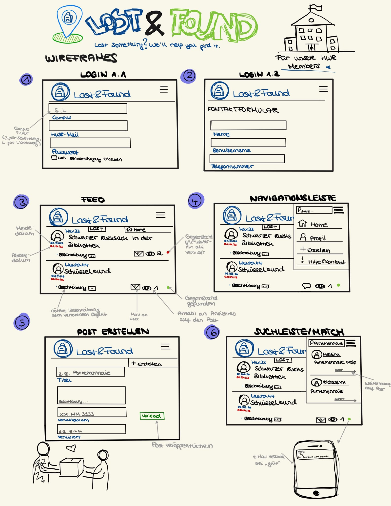
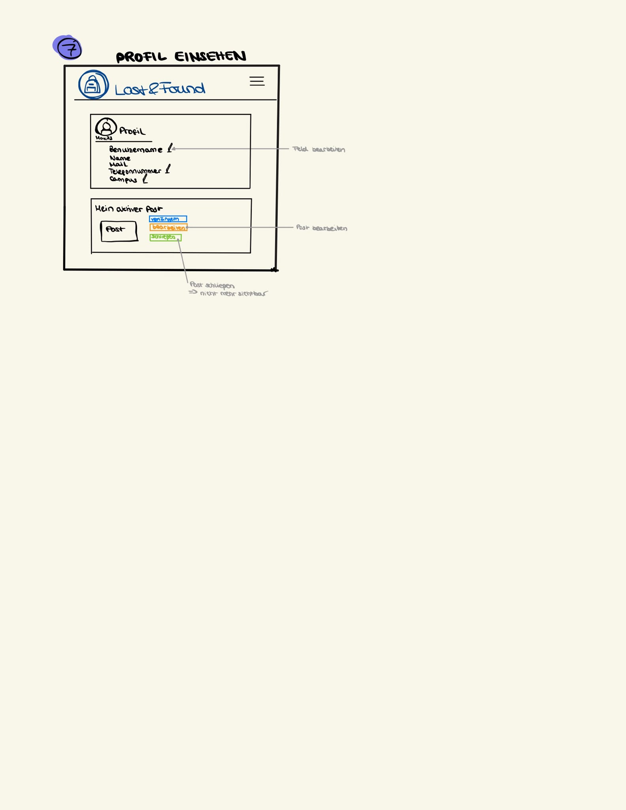

{: .no_toc }
# Value Proposition

Table of contents

+ ToC
{: toc }
{: .text-delta }

## Value Proposition

The Problem

Wir haben schon alle einmal unsere Sachen verloren. Vor allem in der Uni, wo wir uns so oft und so lange befinden, verliert man unter dem Stress auch Gegenstände. Jedoch wenige gehen wirklich ins Fundbüro: Ist gerade jemand da? Habe ich gerade Zeit? ... etc. Diese Gedanken spielen keine Rolle mehr, wenn alles digital ist. Viele der Studierenden und Dozenten wissen oftmals nicht wohin mit gefundenen Sachen. Gebe ich diese beim Pförtner ab oder lasse ich sie einfach liegen falls jemand zurückkommt...? Die Existenz unseres Fundbüros ist nicht einmal jedem bewusst. Mit unserer Web App entlasten wir nicht nur die Studierenden bei ihrer ständigen stressvollen Suche nach verlorenen Sachen, sondern Unterstützen auch das Fundbüro Personal. Ständige Anrufe von Studierenden und Dozenten die gestresst auf der Suche sind beeinträchtigen das vorangehen der Mitarbeiter. Nicht nur müssen sie mehrfache Anrufe tätigen sondern  zusätzlich mitteilen wo sie sich befinden und anwesend sein damit Sachen abgeholt werden. Mithilfe unserer Web App LostAndFound sorgen wir dafür, dass dieser ganze Prozess vereinfacht und verschnellert wird. SO muss dass Fundbüro nur prüfen ob es sich wirklich um den Gegenstand handelt der gesucht wird den Status von Posts angeben und aktualliesieren. Der Nutzer weiß somit durch den Status was sein nächster Schritt ist und spart dem Fundbüro jegliche Kopfschmerzen.   

## LostAndFound

Our Solution 

 Mit LostAndFound wollen wir dieses Problem lösen. Eine App in der die Menschen aus der HWR einen Post veröffentlichen inklusive einer Beschreibung zu ihrer verlorenen Sache. Falls jemand diesen Post sieht bzw. nach einem Post dazu sucht und auch den Gegenstand gefunden hat, dann kann diese Person den Suchenden kontaktieren. Des Weiteren, kann das Fundbüro auch die Suchenden kontaktieren, falls der Gegenstand sich dort befindet. Gedacht ist diese Platform nur für Personen mit einer hwr domain, sodass es ein digitales HWR-Fundbüro ist.
 
#### Es handelt sich hierbei um eine two-sided Platform:  Sucher(Nutzer-Hwr-Mitglied) interagiert mit dem Fundbüro der Hwr
Die Web App verbindet die Nutzer (Suchenden) mit dem Fundbüro. Die Suchenden erstellen Posts mit ihren verlorenen Sachen, währen diese mit den gefundenen Objekten im Fundbüro abgeglichen werden. Das Fundburö verwaltet dann diese Gegenstände, aktualisiert den Status der Posts und informiert die Besitzer sobald ein Objekt abholbereit ist. Dadurch ensteht der direkte Austausch zwischen beiden Seiten über die Webapp. 

## Target User(s)

Die Zielgruppe der Anwendung sind Studierende, Dozierende und Mitarbeitende der HWR Berlin.

Die Plattform richtet sich ausschließlich an Personen mit einer gültigen HWR-E-Mail-Adresse und bildet somit ein digitales, campusinternes Lost-and-Found-System.

## Happy Path

1. Ein HWR-Mitglied registriert sich mit seiner HWR-E-Mail-Adresse.
2. Die Person erstellt eine Suchanzeige für einen verlorenen Gegenstand.
3. Die Anzeige erscheint im Feed des jeweiligen Campus.
4. Ein anderes HWR-Mitglied oder das Fundbüro erkennt den Gegenstand wieder.
5. Die suchende Person wird kontaktiert.
6. Der Gegenstand wird wiedergefunden und die Anzeige kann geschlossen werden.

## Target Scope

Zu Beginn des Projekts wurden Scribbles erstellt, um die geplanten Funktionen und den Aufbau der Benutzeroberfläche zu visualisieren. Die Scribbles dienten als Grundlage für die spätere Umsetzung der Webanwendung.

### Weitere Ansicht

