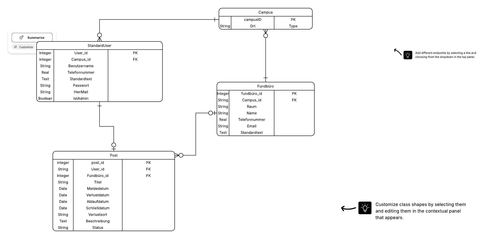

{: .no_toc }
# Data Model

Table of contents

+ ToC
{: toc }
{: .text-delta }

## Beschreibung des Datenmodells

Das Datenmodell von LostAndFound besteht aus vier zentralen Entitäten: Campus, StandardUser, Fundbüro und Post.

Ein StandardUser gehört genau einem Campus und kann mehrere Suchanzeigen (Posts) erstellen. Jeder Post enthält Informationen zu einem verlorenen Gegenstand, wie Titel, Beschreibung, Verlustort, Verlustdatum sowie den aktuellen Status der Suche.

Jedes Fundbüro ist einem Campus zugeordnet und kann Suchanzeigen verwalten beziehungsweise mit gefundenen Gegenständen abgleichen. Dadurch entsteht die Verbindung zwischen Suchenden und dem zuständigen Fundbüro.

Die Entität Campus dient als organisatorische Grundlage der Anwendung. Sowohl Nutzer als auch Fundbüros werden einem Campus zugeordnet, wodurch Suchanzeigen campusbezogen gefiltert und angezeigt werden können.

