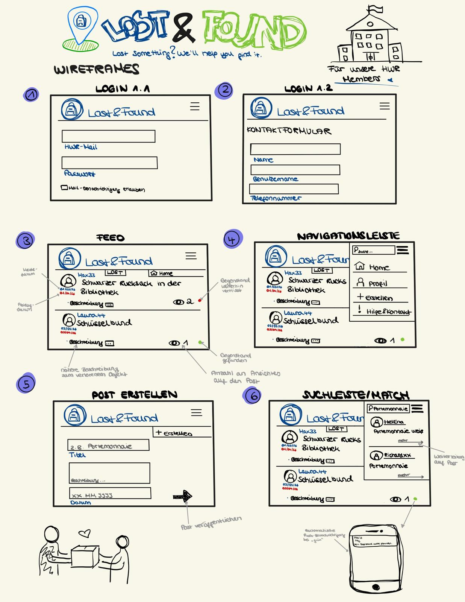

# Project Name: LostAndFound
Dinge gehen verloren.
Lost&Found bringt sie zurück. Unser Projekt Lost&Found ist eine Webanwendung, die Studienerende an der HWR und Fundbüros miteinander verbindet, um verlorene Gegenstände durch eine zentrale Plattform schnell und effizient wiederzufinden.

## Gruppe: CampusFinder

•⁠  ⁠77204183234, Hawa Si Moussa 

•⁠  ⁠77209887107, Fatme Berjaoui

•⁠  ⁠77209886771, Sarah Tayem

## Value Proposition

 *The Problem*

Wir haben schon alle einmal unsere Sachen verloren. Vor allem in der Uni, wo wir uns so oft und so lange befinden, verliert man unter dem Stress auch Gegenstände. Jedoch wenige gehen wirklich ins Fundbüro: Ist gerade jemand da? Habe ich gerade Zeit? ... etc. Diese Gedanken spielen keine Rolle mehr, wenn alles digital ist. Viele der Studierenden und Dozenten wissen oftmals nicht wohin mit gefundenen Sachen. Gebe ich diese beim Pförtner ab oder lasse ich sie einfach liegen falls jemand zurückkommt...? Die Existenz unseres Fundbüros ist nicht einmal jedem bewusst. Mit unserer Web App entlasten wir nicht nur die Studierenden bei ihrer ständigen stressvollen Suche nach verlorenen Sachen, sondern Unterstützen auch das Fundbüro Personal. Ständige Anrufe von Studierenden und Dozenten die gestresst auf der Suche sind beeinträchtigen das vorangehen der Mitarbeiter. Nicht nur müssen sie mehrfache Anrufe tätigen sondern  zusätzlich mitteilen, wo sie sich befinden und anwesend sein damit Sachen abgeholt werden. Mithilfe unserer Web App LostAndFound sorgen wir dafür, dass dieser ganze Prozess vereinfacht und verschnellert wird. So muss das Fundbüro nur prüfen, ob es sich wirklich um den Gegenstand handelt der gesucht wird, den Status von Posts angeben und aktualiesieren. Der Nutzer weiß somit durch den Status, was sein nächster Schritt ist und spart dem Fundbüro jegliche Kopfschmerzen.   

## LostAndFound

*Our Solution* 

 Mit LostAndFound wollen wir dieses Problem lösen. Eine App in der Leute einen Post veröffentlichen mit einer Beschreibung der verlorenen Sache. Falls jemand diesen Post sieht bzw. nach einem Post dazu sucht und auch den Gegenstand gefunden hat dann kann diese Person den Suchenden kontaktieren. Des Weiteren, kann das Fundbüro auch die Suchenden kontaktieren, falls der Gegenstand sich dort befindet. Gedacht ist diese Platform nur für Personen mit einer HWR domain, sodass es ein digitales HWR-Fundbüro ist. Dies gilt für beide Campusse in Berlin.
 
#### Es handelt sich hierbei um eine two-sided Platform:  Sucher(Nutzer-Hwr-Mitglied) interagiert mit dem Fundbüro der Hwr
Die Web App verbindet die Nutzer (Suchenden) mit dem Fundbüro. Die Suchenden erstellen Posts mit ihren verlorenen Sachen, während diese mit den gefundenen Objekten im Fundbüro abgeglichen werden. Das Fundburö verwaltet dann diese Gegenstände, aktualisiert den Status der Posts und informiert die Besitzer sobald ein Objekt abholbereit ist. Dadurch ensteht der direkte Austausch zwischen beiden Seiten über die Webapp. 

## Funktionen 
Alle Posts haben einen Status zur besseren Übersicht. 
1. Grün: zeigt an dass der Gegenstand gefunden wurde und im Fundbüro abgeholt werden kann 
2. Rot: zeigt an dass der Gegenstand noch nicht gefunden wurde bzw. nicht im Fundbüro liegt
3. Grau: zeigt an dass der Post archiviert ist

Wenn ein Gegenstand gefunden wurde erhält der Nutzer per Mail eine Benachrichtigung, dass der Artikel im Fundbüro liegt und abgeholt werden kann. Ein Post ist nur für 15 Tage aktiv mit dem Status "grün", sodass der Nutzer genug Zeit hat seinen Gegenstand im Fundbüro abzuholen. Wird dieser in der festgelegten Zeit nicht abgeholt, wird der Post automatisch archiviert. Bei Status "rot" gilt ein Ablaufdatum, welches 30 Tage nach dem Meldedatum, eintritt. Läuft diese Frist ab wird auch dieser Post archiviert, um die App so einfach und übersichtlich zu halten. Die Frist kann jedoch manuell verlängert werden, falls der Gegenstand weiterhin gesucht wird und nicht in Vergessenheit geraten ist. Nach der Archivierung ist der Post für die Nutzer nicht mehr sichtbar. Der Zugriff ist nur dem Fundbüro und den Web-App Entwicklern gewährleistet, um alles unter Kontrolle zu haben. 

## Regeln 
Jeder Nutzer darf nur eine offene Suchanzeige erstellen. Somit soll verhindert werden, dass die Web App missbraucht wird und unrealistische Spam Posts erstellt werden. Außerdem ist es eher unwahrscheinlich, dass innerhalb kurzer Zeit viele unterschiedliche Gegenstände verloren gehen. Häufig kommt es vielmehr vor, dass mehrere ähnliche oder sogar identische Gegenstände abgegeben werden. Beispielsweise können vier identische Adapter gefunden werden, wodurch nicht eindeutig festgestellt werden kann, wem welcher Adapter gehört. In solchen Fällen gilt das Prinzip: Wer den Gegenstand zuerst beansprucht und glaubhaft beschreiben kann, erhält ihn.

## Nicht umgesetzte Designentscheidung 
Die Idee Kategorien für die verlorenen Gegenstände einzuführen, um die Benutzerfreundlichkeit und Übersicht für die Nutzer zu verbessern entfiel aufgrund mehrerer möglicher Probleme, die hätten entstehen können. Darunter zählen falsche Eingaben weshalb somit mehrere Gegenstände möglicherweise falsch eingeordnet werden oder der Suchprozess im Allgemeinen ungenau und unvollständig werden könnte. Zwar hatten wir bereits mögliche Lösungsansätze für dieses Problem überlegt. Beispielsweise hätten Nutzer falsch kategorisierte Gegenstände melden können, damit diese nachträglich korrigiert werden. Eine weitere Idee war, den Nutzern selbst die Möglichkeit zu geben, die passende Kategorie festzulegen oder zu ändern. Beide Ansätze hätten jedoch zusätzlichen Aufwand bedeutet. Außerdem besteht weiterhin das Risiko, dass Kategorien absichtlich oder versehentlich falsch gewählt werden, wodurch erneut Unordnung und Verwirrung entstehen könnten. Unser Ziel ist eine Web App zu entwickeln, die Erleichterung ansatt Verwirrung einherbringt, deshalb haben wir uns als Gruppe dagegen entschieden.

## Target Users

**Fatme Berjaoui:**
Mein Ziel ist es, eine Note von 1,3 oder 1,7 zu erreichen. Während der Erstellung der Web-App 
möchte ich sehr viel über das Programmieren mit Python lernen, vor allem da diese Sprache neu 
für mich ist. Am Ende des Kurses möchte ich zu den einen sicheren Umgang mit HTML, Git, 
GitHub sowie Python erreichen. Das aller wichtigste ist allerdings das ich die neu erlernten 
Kenntnisse mit meinen bisherigen Erfahrungen verbinden möchte, um in der Zukunft noch mehr 
Projekte umsetzen zu können. 

**Hawa Si Moussa :**
Meine Zielnote liegt bei 1,3 oder 1,7. Ich möchte verstehen wovon eine Web App abhängt und die 
einzelnen Schritte vollständig nachvollziehen, um somit in der Zukunft weitere Web-Apps 
entwickeln zu können. Zudem erhoffe ich mir viele Erfahrungen mit Python und HTML sammeln zu 
können. Am Ende des Kurses möchte ich eine erfolgreiche und für mich sinnvolle Web App erstellt 
haben, die ich mit meinem später erweiterten Wissen und Ideen ausbauen kann. 

**Sarah Tayem:**
Meine Zielnote in diesem Kurs liegt ebenfalls zwischen 1,3 und 1,7. Ich selber hab nicht viel Wissen über WebApps genau und habe nur ein paar mal davon gehört, deshalb möchte ich mithilfe dieses Kurses, wenn mich jemand fragt "Was genau ist eine webApp, wie funktioniert sie und was unetrscheidet sie von einer normalen App?" Mit Leichtigkeit und Richtigkeit beantworten können. Ich möchte auch stolz auf mein erarbeites Projekt sein und, wie ich es auch bei restlichen Projekten in anderen Kursen tat, immer wieder was neues bezüglich des arbeiten in Projekten lernen (Projektmanagement). Ich möchte auch Python erlernen, ohne dass ich ständig eine KI fragen stellen muss. Mein Ziel ist es Python so zu erlernen, dass ich die Syntaxt völlig verstehe und Fehler in fremden Codes z.B. erkennen kann. Ich denke diese Kenntnisse snd besonders hilfreich für meine Zukunft, da ich nicht jemand sein möchte der nur "weiß" sondern sich auch auskennt.

## Bereits erarbeite Arbeitsbereiche + Zuteilung 

| Name | Matrikelnummer | Aufgabe |
|---|---|---|
| Hawa Si Moussa | 77204183234 | Benutzeroberfläche (Frontend) |
| Fatme Berjaoui | 77209887107 | GitHub & Repository |
| Sarah Tayem | 77209886771 | Datenbankverwaltung (Nutzer und Beiträge) |

## Scribbles of UI screens

