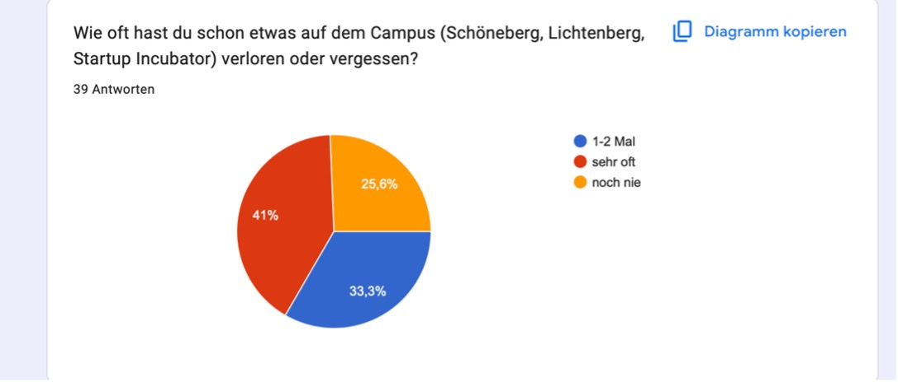
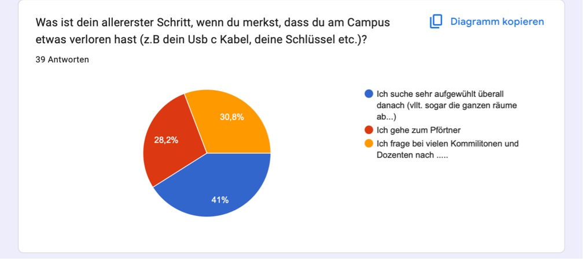
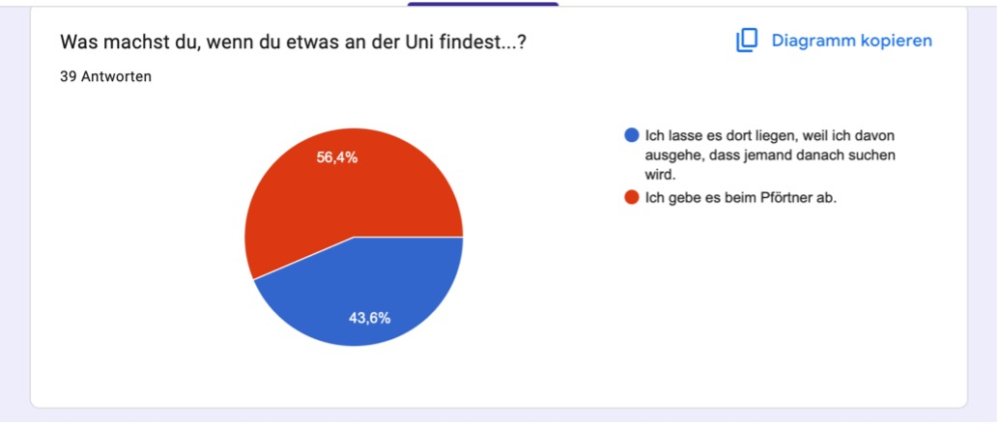
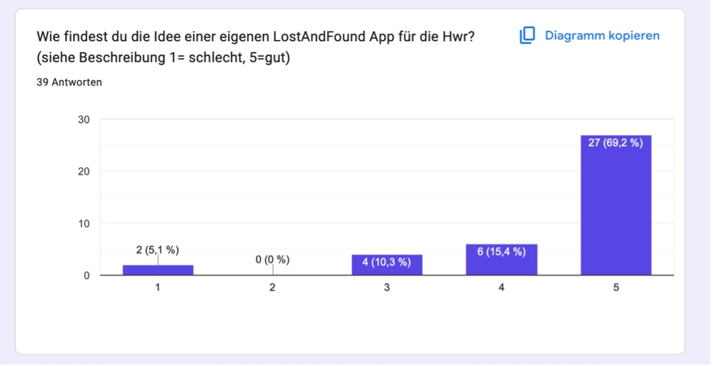
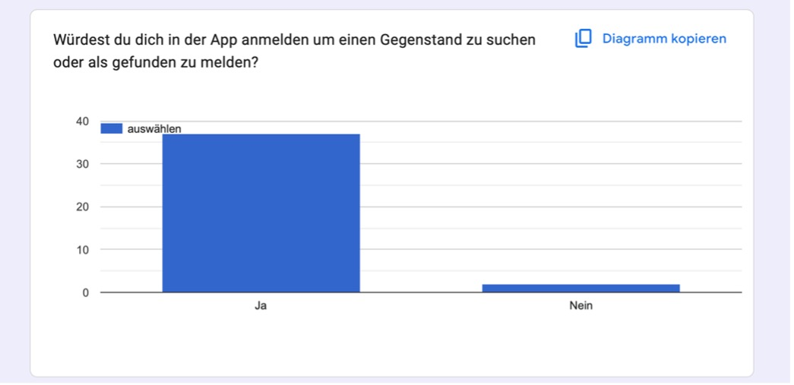
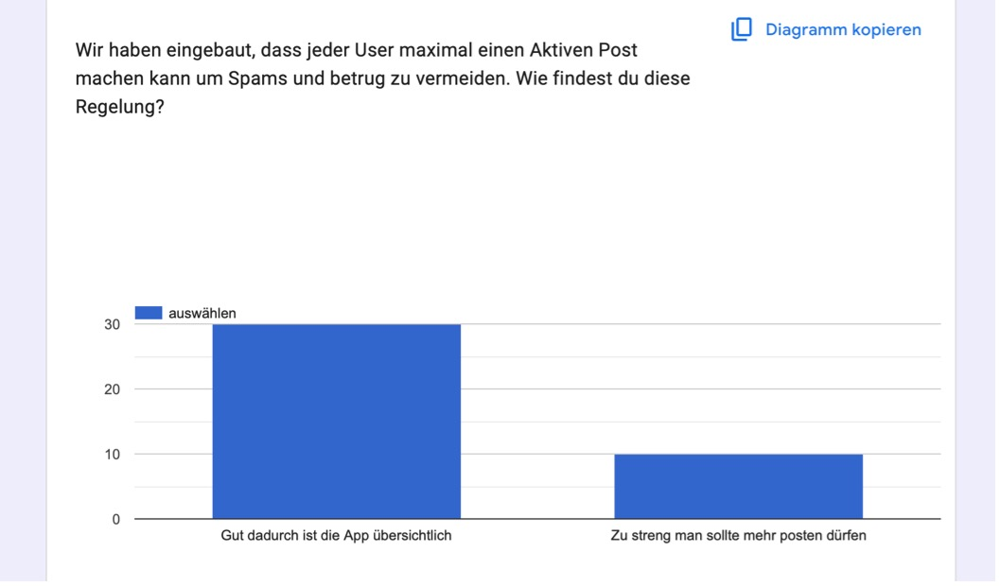
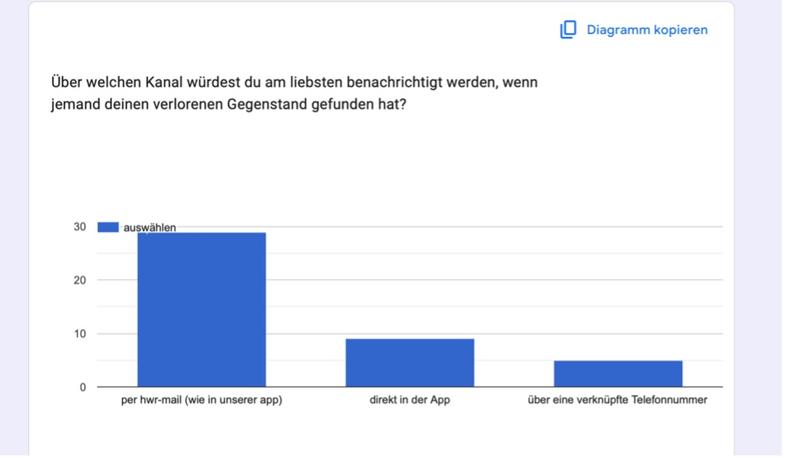
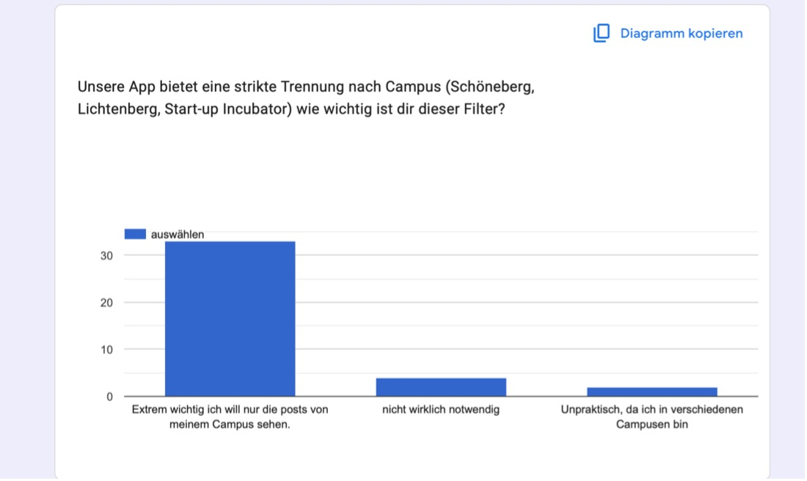

{: .no_toc }
# Tests

## [Umfrage]
[Umfrage](https://docs.google.com/forms/d/e/1FAIpQLSf6jpJChhextobFYC7Kn5EdM3cIHJBvHsHC9JkZ5yU6hA1nPQ/viewform)

##  1. Wie oft hast du schon etwas auf dem Campus verloren oder vergessen?

 Bei dieser Frage gaben 41 % der Teilnehmenden an, „sehr oft“ etwas zu vergessen, und 33,3 % passierte dies „1–2 Mal“ also insgesamt 74,3 %, während nur 25,6 % noch nie etwas verloren haben. Für uns bedeutet das, dass fast drei Viertel unserer Zielgruppe dieses Problem aus dem Alltag kennen, was die enorme Relevanz und den Nutzen unserer App schwarz auf weiß beweist.

## 2. Was ist dein allererster Schritt, wenn du merkst, dass du am Campus etwas verloren hast? 

 Hier zeigt sich eine unterschiedliche Verteilung der Antworten , da 41 % aufgewühlt überall suchen, 30,8 % bei Kommilitonen oder Dozenten nachfragen und 28,2 % zum Pförtner gehen. Für uns bedeutet das, dass der aktuelle Suchprozess extrem stressig und unkoordiniert abläuft, weshalb wir mit unserer Webapp als die ständigen Suchen und den Stress der Studierenden massiv senken können, sowie Ordnung hineinbringen können.

## 3. Was machst du, wenn du etwas an der Uni findest?

 

  Während 56,4 % gefundene Sachen beim Pförtner abgeben, lassen 43,6 % den Gegenstand einfach liegen, weil sie davon ausgehen, dass der Besitzer danach sucht. Für uns bedeutet das, dass fast die Hälfte aller Fundsachen verloren geht, weil der Weg zum Pförtner zu umständlich ist. Mit unserer App können die Studenten bzw. die Finder die Sachen in wenigen Minuten mithilfe unserer App den Anzeigen zuordnen und somit möglicherweise den Besitzer finden. Das wird das Fundbüro an der HWR drastisch entlasten.

## 4. Wie findest du die Idee einer eigenen LostAndFound App für die HWR? (1 = schlecht, 5 = gut) 

  

  Bei dieser Frage stimmten überwältigende 69,2 % mit der Bestnote 5 ab und weitere 15,4 % gaben eine 4, was insgesamt 84,6 % positive Rückmeldungen ergibt. Für uns bedeutet, dass die endgültige Bestätigung unseres Projekts, da die absolute Mehrheit der Studierenden unsere App aktiv befürwortet und sie unbedingt haben will. 
  
## 5. Würdest du dich in der App anmelden, um einen Gegenstand zu suchen oder als gefunden zu melden?

 

 Die deutliche Mehrheit von rund 92 % (36 von 39 Stimmen) antwortete hier mit „Ja“, während nur eine minimale Minderheit mit „Nein“ stimmte. Für uns bedeutet das, dass die Nutzer unsere App nutzen würden und einen Gebrauch darin sehen. 

## 6. Meinung zur Regelung, dass jeder User maximal einen aktiven Post machen kann um Spam/Betrug zu vermeiden: 

Rund 74 % (29 Stimmen) finden diese Regelung gut für die Übersichtlichkeit, während 26 % (10 Stimmen) sie als zu streng empfinden. Für uns bedeutet das, dass wir diese Sicherheitsfunktion für normale Studierende beibehalten, in der Entwicklung haben wir aber für den Pförtner oder die Verwaltung Sonderrechte eingebaut, damit diese unbegrenzt posten können und nicht eingeschränkt sind.

## 7.Über welchen Kanal würdest du am liebsten benachrichtigt werden, wenn jemand deinen verlorenen Gegenstand gefunden hat? 

Eine klare Mehrheit von rund 72 % (28 Stimmen) wünscht sich die Benachrichtigung per HWR-Mail (wie in unserer App), während der Rest sich auf App Benachrichtigungen oder Telefonnummern verteilt. Für uns bedeutet das, dass unsere Entscheidung den meisten Nutzerwünschen entspricht und die HWR-Mail das Vertrauen stärkt sowie dafür sorgt das unberechtigte die Webapp nicht Missbrauchen können.

## 8. Wie wichtig ist dir die strikte Trennung nach Campus (Schöneberg, Lichtenberg, Start-up Incubator) als Filter?

Ganze 87 % (34 Stimmen) gaben an, dass ihnen dieser Filter „extrem wichtig“ ist, da sie nur Posts vom eigenen Campus sehen wollen. Für uns bedeutet das, dass diese Funktion ein absolutes Must have bei der Umsetzung ist und wir bei der Registrierung zwingend eine Standort Auswahl einbauen müssen, damit der Feed für jeden Nutzer sofort übersichtlich bleibt.
